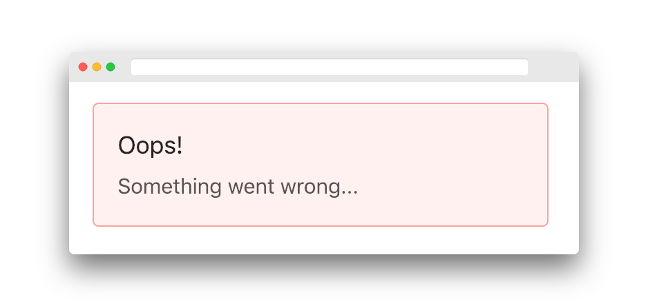

# ErrorState State

Sometimes, you may want know if a service or flow failed. If so, you may display a error message on your web page:



In reobservable, there is a built-in sub-state called `error` in the root state:

```ts
{
  error: {
    services: {
      fetchUser: 'bad request'
    },
    flows: {
      'user/fetch': 'cannot read id of undefined'
    }
  }
}
```

As you can see, there are two type of error state in reobservable.

## Service Error

Service error indicates if a service is failed. You call a service inside a flow like:

```ts
const model = {
  name: 'user',
  // ....
  flows: {
    fetch(flow$, action$, payload$, dependencies) {
      const { api } = dependencies.services
      
      return flow$.pipe(
        switchMap(action => {
          const [success$, error$] = api(
            // service name
            'fetchUser',
            service.fetchUser(params)
          )
          // ...
        })
      )
    }
  }
}
```

Because we named the service `fetchUser`, then we can inspect service error by:

```ts
const mapStateToProps = (state: IState) => {
  const userFetchError = state.error.services['fetchUser']
}
```

## Flow Error

Flow error indicates if a flow is failed. Like service error, you can access flow error by:

```ts
const mapStateToProps = (state: IState) => {
  const nameChangingError = state.loading.flows['user/changeName']
}
```