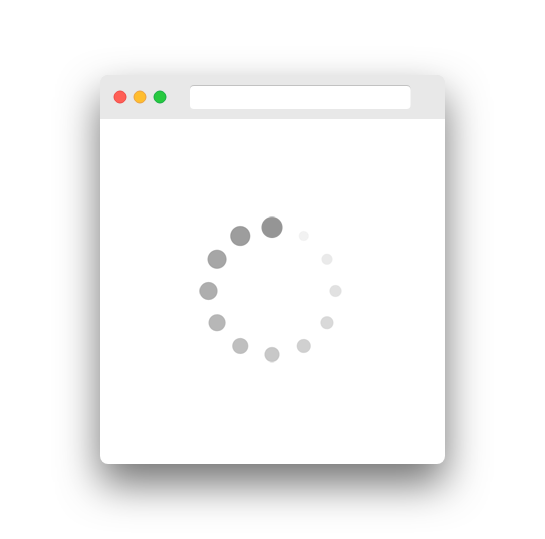

# Loading State

Sometimes, you may want know if a service or flow is running. If so, you may display a loading spinner on your web page:



In reobservable, there is a built-in sub-state called `loading` in the root state:

```ts
{
  loading: {
    services: {
      fetchUser: true
    },
    flows: {
      'user/fetch': true
    }
  }
}
```

As you can see, there are two type of loading state in reobservable.

## Service Loading

Service loading indicates if a service is running. You call a service inside a flow like:

```ts
const model = {
  name: 'user',
  // ....
  flows: {
    fetch(flow$, action$, payload$, dependencies) {
      const { api } = dependencies.services
      
      return flow$.pipe(
        switchMap(action => {
          const [success$, error$] = api(
            // service name
            'fetchUser',
            service.fetchUser(params)
          )
          // ...
        })
      )
    }
  }
}
```

Because we named the service `fetchUser`, then we can access it by:

```ts
const mapStateToProps = (state: IState) => {
  const isUserFetching = state.loading.services['fetchUser']
}
```

## Flow Loading

Flow loading indicates if a flow is running. But in order to tell reobservable if a flow should be considered complete, you should use `end` or `endTo` operator to emit an end action:

```ts
import { end } from '@reobservable/core'

const model = {
  name: 'user',
  // ....
  flows: {
    changeName(flow$, action$, payload$, dependencies) {
      return flow$.pipe(
        end(action => ({
          type: 'user/changeName',
          payload: {
            name: action.payload.name
          }
        }))
      )
    }
  }
}
```

Then, you can access it by:

```ts
const mapStateToProps = (state: IState) => {
  const isNameChanging = state.loading.flows['user/changeName']
}
```